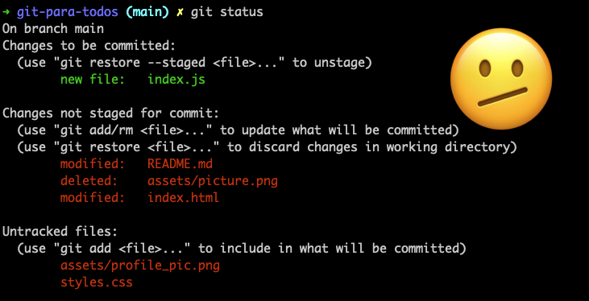

# 🎨 Colorize Git Status
**Before**



**After**


You can colorize the output of `git status` using:

```
git config color.status.[element] [color]
```
example: `git config color.status.header magenta`


This command can also receive two colors, the first one will be the foreground color and the second one the background color. When sending more than one param, keep in mind the usage of quotes:
```
git config color.status.[element] "[foreGroundcolor] [backgroundColor]"
```
example: `git config color.status.added magenta white`


You can also add some extra attributes to change the text style:
```
git config color.status.[element] [style]
```
example: `git config color.status.changes bold`

And mix it up ✨
- `git config color.status.changes "green white bold"`
- `git config color.status.changes "cyan italic"`


## Elements
- `header` the header text of the status message
- `added` or `updated` files which are added but not committed
- `changed` files which are changed but not added in the index
- `untracked` files which are not tracked by Git
- `branch` the current branch
- `nobranch` the color the no branch warning is shown in, defaulting to red
- `localBranch` or `remoteBranch` the local and remote branch names, respectively, when branch and tracking information is displayed in the status short-format
- `unmerged` files which have unmerged changes

## Colors

- normal
- black
- red
- green
- yellow
- blue
- magenta
- cyan
- white 
- You may also use ANSI or Hexadecimal colors if your terminal supports it


## Text styles

- bold
- dim
- ul
- blink
- reverse
- italic
- strike

### Docs
- https://git-scm.com/docs/git-config#Documentation/git-config.txt-colorstatus
- https://git-scm.com/docs/git-config#Documentation/git-config.txt-color
