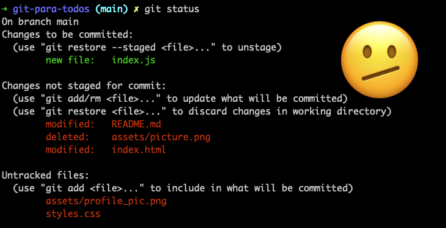
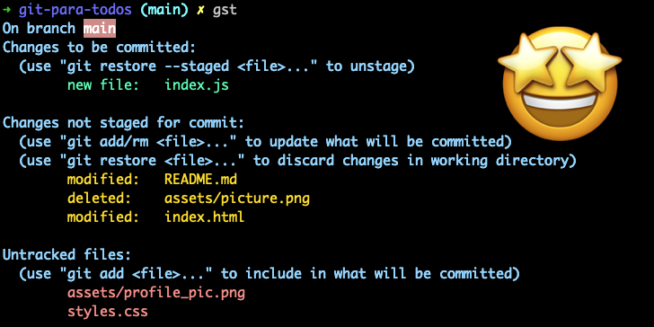

# 🎨 Agregarle color a Git Status
**Antes**



**Despues**



Puedes agregarle color al resultado de `git status` utilizando:

```
git config color.status.[element] [color]
```
ejemplo: `git config color.status.header magenta`


Este comando tambien puede recibir dos colores, el primero va a ser el color de la letra y el segundo el color de fondo. Cuando envías mas de un parámetro recuerda utilizar comillas:
```
git config color.status.[element] "[foreGroundcolor] [backgroundColor]"
```
ejemplo: `git config color.status.added magenta white`


Tambien puedes agregar atributos extra para cambiar el estilo del texto:
```
git config color.status.[element] [style]
```
ejemplo: `git config color.status.changes bold`

Y combinarlos ✨
- `git config color.status.changes "green white bold"`
- `git config color.status.changes "cyan italic"`


## Elementos
- `header` el encabezado del mensaje de status
- `added` o `updated`  arcchivos que han sido agregados pero no se les ha hecho commit
- `changed` archivos que han sido modificados pero no han sido agregados al índice
- `untracked` archivos que aún no han sido agregados al repositorio
- `branch` rama actual
- `nobranch` color en el que se muestra la advertencia de no branch 
- `localBranch` o `remoteBranch` el nombre de la rama local y remota, cuando la rama y la información de seguimiento es mostrada en el formato corto del status
- `unmerged` archivos que tienen cambios pendientes por merge

## Colores

- normal
- black
- red
- green
- yellow
- blue
- magenta
- cyan
- white 
- Tambien puedes utilizar colores ANSI o Hexadecimales si tu terminal lo soporta


## Estilos de texto

- bold
- dim
- ul
- blink
- reverse
- italic
- strike

### Documentación
- https://git-scm.com/docs/git-config#Documentation/git-config.txt-colorstatus
- https://git-scm.com/docs/git-config#Documentation/git-config.txt-color
